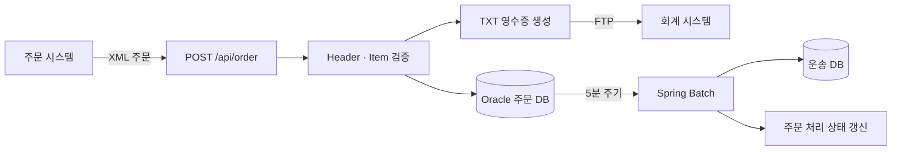

# ORDER_EAI

XML 주문 수신부터 데이터베이스 저장, 영수증 파일 생성, FTP 전송, 운송 데이터 배치 처리까지 구현한 Spring 기반 EAI 연계 프로젝트입니다. 서로 다른 시스템의 데이터 형식과 처리 주기를 연결하면서 입력 정합성, 부분 실패, 배치 상태 변경을 다뤘습니다.

## 처리 흐름



## 주요 기능

- XML 형식의 주문 Header·Item 수신
- 사용자 식별자 기준 Header·Item 연결과 누락 데이터 검증
- 유효 주문의 Oracle 저장
- 성공·실패 건수와 오류 상세를 포함한 동기 응답
- 주문별 TXT 영수증 생성
- Apache Commons Net 기반 FTP 전송
- 5분 주기 Spring Batch 실행
- 미처리 주문의 운송 데이터 변환과 처리 상태 갱신
- 요청 ID 기반 로그 추적

## 구현 포인트

### 입력 정합성 검증

wrapper 없이 반복되는 XML `HEADER`와 `ITEM`을 Jackson XML로 역직렬화합니다. 두 데이터 집합을 사용자 식별자로 연결하고, Header만 존재하거나 Item만 존재하는 경우와 필수값 누락을 분리해 결과에 반영합니다.

### 업무 처리와 파일 연계

검증을 통과한 주문을 Oracle에 저장하고 주문 내용을 TXT 영수증으로 만듭니다. 생성된 파일은 FTP passive mode와 binary 전송 방식으로 회계 시스템에 전달합니다.

### 배치 처리

Spring Batch Job이 5분마다 미처리 주문을 조회합니다. `ItemProcessor`에서 운송 데이터로 변환하고 `ItemWriter`에서 저장과 원 주문 상태 갱신을 처리합니다. 매 실행마다 고유한 Job Parameter를 생성해 Job Instance 충돌을 막습니다.

### DataSource 분리

- Oracle: 주문과 운송 업무 데이터
- H2: Spring Batch 메타데이터

`@Primary` 업무 DataSource와 `@BatchDataSource` 메타데이터 DataSource를 분리해 각 저장소의 역할을 명확히 했습니다.

## 문제 해결

### 조회 상태 변경으로 인한 Batch 누락

페이지 단위로 `status=N` 주문을 조회하면서 처리된 데이터의 상태를 `Y`로 바꾸자 다음 페이지의 기준 위치가 이동해 일부 주문이 건너뛰었습니다. 실제 처리 건수 차이로 문제를 재현하고 조회 방식과 쿼리를 수정했습니다.

### FTP 550 오류

서버 응답 코드, 원격 작업 디렉터리, 권한과 파일명 인코딩을 순서대로 점검했습니다. UTF-8 제어 인코딩을 FTP 연결 전에 설정하고 전송 디렉터리를 명시해 파일 전송을 정상화했습니다.

### 요청 단위 추적

Filter에서 요청 ID를 생성하고 로그에 포함해 XML 수신, DB 저장, 파일 생성, FTP 전송 과정을 한 흐름으로 추적할 수 있게 했습니다.

## 기술 스택

- Java 17
- Spring Boot 3.5.11
- Spring Batch
- Spring Data JPA
- Jackson Dataformat XML
- Oracle Database, H2
- Apache Commons Net FTP Client
- Logback
- Gradle

## 프로젝트 구조

```text
src/main/java/com/jmna/order_eai
├─ batch        # Scheduler, Processor, Writer
├─ config       # Batch와 DataSource 설정
├─ controller   # XML 주문 수신 endpoint
├─ dto          # 요청·응답 모델
├─ entity       # 주문·운송 데이터 모델
├─ filter       # 요청 ID와 로그 추적
├─ repository   # 주문·운송 데이터 접근
└─ service      # 주문 처리, 영수증 생성, FTP 전송
```

## API

### 주문 수신

```http
POST /api/order
Content-Type: application/xml
```

응답에는 전체 요청 건수, 성공·실패 건수와 실패 상세가 포함됩니다.

## 실행 방법

### 준비 사항

- Java 17
- Oracle Database
- 영수증 파일을 받을 FTP 서버

`src/main/resources/application.properties`에 업무 DB와 FTP 접속 정보를 설정합니다.

```properties
# Oracle
spring.datasource.jdbc-url=
spring.datasource.username=
spring.datasource.password=
spring.datasource.driver-class-name=oracle.jdbc.OracleDriver

# FTP
inspien.ftp.host=
inspien.ftp.port=21
inspien.ftp.user=
inspien.ftp.password=
inspien.ftp.file_path=
```

접속 정보가 포함된 설정 파일은 저장소에 커밋하지 않습니다. Batch 메타데이터용 H2 DataSource는 애플리케이션 내부에서 구성됩니다.

```bash
./gradlew bootRun
```

Windows에서는 다음 명령을 사용할 수 있습니다.

```powershell
.\gradlew.bat bootRun
```


